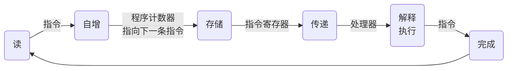
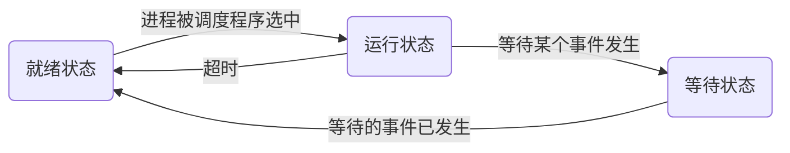
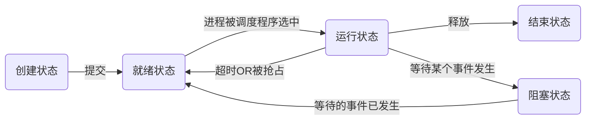
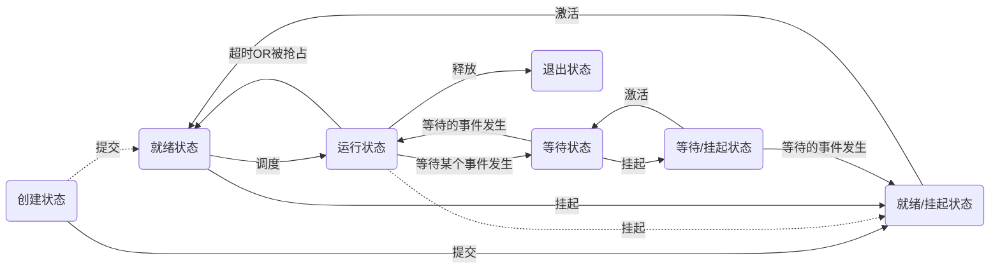

# 操作系统
## 1 操作系统概论
### 1.1 操作系统的概念

计算机系统：一种可以按用户要求接收和存储信息、自动进行数据处理并输出结果信息的系统。其包含：
* 硬件系统：计算机赖以工作的实体。
* 软件系统：计算机按用户指定的要求协调工作。

操作系统：它是一些程序模块的集合，他们能**有效组织和管理计算机系统中的硬件及软件资源**，合理组织计算机工作流程。有着与其他软件相比所不同的特征：
* 并发性：指在计算机系统中同时存在多个运行着的程序。宏观上看，这些程序在同时向前推进；微观上看，单处理器环境下，这些程序交替在处理器上运行，多处理器时也为并发。
* 共享性：指操作系统程序与多个用户程序共用系统中的各种资源。
    * 互斥共享：当某个资源被占用时，其他请求该资源的程序必须等待。
    * 同时共享：同一段时间内，资源可以被多个程序同时（宏观）访问。
* 随机性：操作系统不能对所运行的程序的行为，以及硬件设备的情况做出事先的假定，强调在进行操作系统设计与实现时要充分考虑各种各样的可能性。

研究操作系统的观点：
1. 软件的观点：操作系统是一种大型的软件系统，具有外在特性和内在特性。
2. 资源管理的观点：操作系统负责登记硬件资源的使用情况，响应资源请求，分配/协调空闲资源。
3. 进程的观点：操作系统控制和协调用户进程和系统进程，管理任务相互之间的关系。
4. 虚拟器的观点：操作系统把原来的计算机扩充成为功能强，使用方便的计算机系统（虚拟计算机）
5. 服务提供者观点：操作系统提供了一系列的功能和便利工作环境为用户服务，则可以把操作系统看作是服务提供者。

操作系统的功能：
1. 进程管理：解决有关处理器分配调度策略、分配的实施和回收等问题
    1. 进程控制：创建进程、撤销结束的进程以及控制进程运行时各种状态的转换。
    2. 进程同步：协调相互协作共同完成任务的进程之间的执行顺序。
    3. 进程间通信：提供相互协作进程之间的数据和信息交换。
    4. 调度：从进程的就绪队列中按照一定算法挑选出一个将处理器资源分配给他，并准备好特定的执行上下文让它执行起来。
2. 存储管理：管理计算机的内存资源
    1. 内存的分配与回收：为每个进程分配内存空间，在分配过程中还要尽可能提高内存资源的使用效能；对于以退出的进程，要对内存加以回收，重新使用。
    2. 存储保护：防止程序运行在被分配内存外运行（越界）对计算机的危害。
    3. 内存扩充：借助于虚拟存储技术，在逻辑上增加进程运行空间的大小。
3. 文件管理：有效地支持文件的存储、检索和修改等操作。
    1. 文件存储空间的管理：为文件分配外存储空间，并且尽可能地提高外存储空间的利用率和文件访问的效能。
    2. 目录管理：给出组织文件的方法。
    3. 文件系统的安全性：防止不正确的方式访问文件。
4. 设备管理：用户通过操作系统提供的设备管理手段对外部设备进行操作。
5. 用户接口：向用户提供使用自己的手段。

### 1.2 操作系统的体系结构

Windows体系结构：分层的模块系统，硬件抽象层、内核和执行体都运行在保护模式下，子系统都在用于模式下运行。
1. 硬件抽象层（HAL）：多种硬件平台可移植性能力的关键部分，为运行在Windows操作系统的硬件平台提供低级接口。
2. 内核：执行Windows操作系统中最基本的操作，如线程调度、陷入处理和异常调度、中断处理和调度以及多处理器同步等。
3. 执行体：从用户态导出并且可以调用的函数
4. 系统进程和系统线程：系统进程是只运行在核心态的系统线程的宿主。系统线程只能在核心态调用。

UNIX体系结构：从内到外分别是硬件、内核、系统调用接口、UNIX命令库或用户应用程序。
1. 内核层：操作系统的管理和控制中心。有两方面接口，分别是**内核与硬件接口和内核与shell接口**；有两大部分组成，分别是进程控制子系统和文件子系统。
2. 系统调用层：介于内核层和应用层之间，是供程序员设计、开发应用时调用。
3. 应用层：面向用户操作的界面。

Linux体系结构：有四个主要部分，即内核、shell、文件系统和用户应用程序。
1. 内核：负责进程、内存、设备驱动程序、文件和网络系统管理。
2. Shell（命令解释器）：是系统的用户界面，提供用户与内核进行交互操作的一种接口。
3. 文件系统：文件存储在磁盘等存储设备上的组织方法。
4. 应用程序。

Android体系结构：分四层，从低到高分别是Linux内核层、系统运行库层、应用框架层和应用程序层。

1. Linux内核层：包括系统层安全机制、内存管理、进程管理、网络堆栈及一系列的驱动模块，提供与硬件的交互。
2. C、C++本地库和Android运行时环境：Android包含一些C/C++库，通过应用框架为开发者提供服务；Android运行时环境提供核心链接库和虚拟系统。
3. Android应用框架层：为应用开发者提供用以访问核心功能的api框架。
4. Android应用程序：包括客户端、日历、地图等，用Java编写。

### 1.3 操作系统的发展

1. 手工操作：通过在一些插板上的硬连线来控制计算机的基本功能（计算），程序设计全部采用机器语言。
2. 监控程序：操作员录入FORTRAN等高级语言程序后，计算机顺次输出结果（单道批处理）。
3. 多道批处理：允许多个程序同时存在于内存之中，由中央处理器以切换方式使多个程序可以同时执行，发展出操作系统。
4. 分时与实时系统：允许多个用户通过终端设备与计算机交互来运行自己的作业，共享同一个计算机系统而互不干扰。
5. UNIX通用操作系统：用C语言编写，是世界上唯一能在笔记本电脑、PC、工作站甚至巨型机上运行的操作系统，是现代操作系统的代表。
6. 个人计算机操作系统：20世纪70年代末，微软推出MS-DOS单用户单任务操作系统；1984年，苹果推出具有图形交互功能的操作系统；1991年，Linus推出继承UNIX全部优点的开源Linux系统。
7. Android操作系统：一款主要面向移动设备、基于Linux内核的开源操作系统。

### 1.4 操作系统分类

批处理操作系统：用户将作业交给系统操作员，操作员在收到作业后，并不立即将作业输入计算机，而是在收到一定数量后，组成一批作业，再把这批作业输入到计算机中。在批处理系统中，用户不能敢于自己作业的运行，发现错误只能重新提交作业。其优点是：作业流程自动化率高，资源利用率高，吞吐量大；其缺点是：用户不能与计算机交互，不适合调试程序。
* 运行模式：为了防止用户的错误而导致整个系统发生不可预料的后果
    * 用户模式：也称目态，只能执行一般指令。一旦用户程序需要执行特权指令，处理器会通过特殊机制将控制权移交给监控程序。
    * 特权模式：也称管态，执行特权指令，包括输入/输出指令、停机等。

分时系统：用户通过终端交互式地向系统提出请求命令，系统接受用户的命令之后，采用时间片轮转方式处理服务请求，并通过方式在终端上显示结果。
* 特点：
    * 多路性：宏观上多人同时使用一台计算机，微观上多人在不同时刻上使用一个处理器。
    * 交互性：用户可以根据响应结果提出下一个请求。
    * 独占性：用户感觉不到计算机同时也在为其他人服务。
    * 及时性：系统能够对用户提出的请求及时给予响应。
* 衡量指标：响应时间
* 处理原则：分时优先，批处理在后。

实时操作系统：能在规定时间内，响应外部事件，同时完成对该事件的处理，并能控制所有实时设备和实时任务协调一致工作。
* 分类：
    * 硬实时系统：火箭控制、飞行控制等。
    * 软实时系统：视频信息处理、银行、订票等。
* 要求能力：实时时钟管理、过载防护、高可靠性。

嵌入式操作系统：运行在嵌入式芯片中，对整个芯片以及它所操作、控制的各个资源进行协调、调度和控制的系统软件。

个人计算机系统：一种单用户多任务的操作系统，满足一般人学习、游戏需要。

网络操作系统：为计算机网络配置的操作系统，其目标是实现相互通信和资源共享。

分布式操作系统：为将大量的计算机通过网络连接在一起，以获得极高的运算能力及广泛的数据共享的操作系统。
* 特征：
    1. 各主机具有统一的操作系统
    2. 实现资源深度共享（算力）
    3. 透明性：用户不感知该系统运行在多少台机器上。
    4. 自治性：各个主机都处于平等地位

### 1.5 操作系统设计

面临困难：
1. 设计复杂程度高：程序长，交换信息多，动态性强，并行性强。
2. 正确性难以保证：功能成分很多，外部设备接口复杂，参与开发的人员基数也较大。
3. 研制周期长：需求分析，编写程序时间长。

设计过程：功能设计、算法设计和结构设计。

设计目标：可靠性（正确性和健壮性）、高效性、易维护性、可移植性、安全性和简明性。

结构设计的重要性：将操作系统这种大型软件划分成若干较小的模块，使之更易维护和可读。计算机结构的复杂化，应用范围的扩大化，也需要对功能进行编排，在部分硬件、软件失效的情况下仍能正常工作。

结构研究的目标：系统模块化、模块标准化和通信规范化。

操作系统的结构：
1. 整体式结构：首先确定操作系统的总体功能，然后将总功能分解成为若干子功能，实现每个子功能的程序称之为模块。
    * 缺点：
        1. 模块间转接随便、相互牵连、独立性差。
        3. 数据基本上作为全程量处理，系统内任意模块都能对其进行存取和修改。
        3. 由于模块组合常以大型表格为中心，为保证数据完整性，往往采用全局封中断法，限制了系统的并发性。
2. 层次式结构：把系统所有功能模块，按功能流程图的调用次序，分别将这些模块排列成若干层，各层之间的模块只能是单向依赖或单向调用。

3. 微内核（客户/服务器）结构：运行在核心态的内核提供线程调度、虚拟内存、消息传递、设备驱动、以及内核的原语操作集和终端处理等；运行在用户态的的操作系统其他部分，如文件系统服务、网络服务等被分为若干个相对独立的进程，提供服务，这就是客户/服务器的运行模式。

## 2 操作系统的运行环境
### 2.1 处理器
> 处理器一般由运算器、控制器、一系列的寄存器以及高速缓存构成。

运算器：实现指令中的算术和逻辑运算

控制器：负责控制程序的运行流程，包括取指令、维护处理器状态、处理器与内存的交互等。

寄存器：用于处理执行指令的过程中暂存数据、地址以及指令信息，具有最快访问速度。
1. 用户可见寄存器：也称通用寄存器，一般包括数据寄存器、地址寄存器以及条件码寄存器
2. 控制和状态寄存器：可以在某种特权状态下访问，由操作系统使用，最常见的是程序计数器、指令寄存器以及程序状态字。

指令执行过程：

特权指令：那些只能由操作系统使用的指令，如设置状态字、设置中断屏蔽、清内存指令和建立存储保护指令等。*为避免陷入混乱，使用多道程序设计技术的计算机指令系统中的指令必须区分为特权指令和非特权指令。*

工作状态：
* 管态：指操作系统管理程序运行状态，具有较高的特权级别，又称为内核态、特权态
* 目态：指一般用户程序运行时状态，具有较低的特权级别，又称为用户态、普通态

状态切换：
1. 目态到管态的切换：唯一途径是通过**中断**
2. 管态到目态的切换：通过设置PSW指令（修改程序状态字）

程序状态字(PSW)：一些特殊的寄存器用，以表明处理器当前的工作状态。通常包括以下状态代码：
1. CPU的工作状态代码：指明当前是目态还是管态
2. 条件码：反映指令执行后的结果特征
3. 中断屏蔽码：指出是否允许屏蔽

### 2.2 计算机系统硬件部件
#### 2.2.1 存储系统

> 中央处理器能直接访问的唯一存储空间时内存储器。

存储器类型：
* 读写型存储器（RAM）：指可以把数据存入任一地址单元，并且可在以后的任何时候把数据读出来
* 只读型存储器（ROM）：指仅能从其中读取数据，但不能随意地用普通方法向其中写入数据

存储器层次结构：
> 存储系统设计主要考虑三个问题：容量、速度和成本。
1. 容量、速度和成本的匹配：较小、较贵而快速的存储设备由较大、较便宜而慢速的存储设备作后盾，在整体上通过对访问频率的控制来提高存储系统的效能。
2. 存储访问局部性原理：设计多级存储体系结构，高频取用数据放高速存储器中

存储器保护：在处理器中设置一对**界限寄存器**来存储用户作业在内存中上限和下限地址，防止操作系统区域被写入数据造成系统崩溃。

#### 2.2.2 I/O部件

I/O结构：外部设备直接通过I/O硬件结构与中央处理器连接，对设备控制器的操作直接由处理器发出I/O指令实现，需要耗费时间轮询各设备状态，已淘汰。

通道：外部设备连接到通道上，由通道代替处理器对I/O操作进行控制，从而使处理器和外部设备可以并行工作。

直接存储其访问（DMA）技术：通过总线中的一个独立控制单元，自动地控制成块数据在内存和I/O单元之间的传送，结束时以向处理器发送中断告知。

缓冲技术：用在外部设备与其他硬件之间的一种数据暂存技术，解决处理器处理数据速度与设备传输速度不匹配问题。

#### 2.2.3 时钟部件

作用：
1. 在多道程序运行环境中，可以为系统发现一个陷入死循环的作业。
2. 在分时系统中，用时钟间隔实现各个作业按时间片轮转运行。
3. 在实时系统中，按要求的时间间隔输出正确的时间信号给相关的实时控制设备。
4. 定时唤醒事先给定的外部事件。
5. 记录用户使用各种设备的事件和记录外部事件发生的间隔。
6. 记录用户和系统所需要的绝对时间。

### 2.3 中断机制
#### 2.3.1 中断与异常概念

中断：指处理器对系统中或系统外发生的异步事件的响应。
* 时钟中断：由处理器内部计时器产生
* 输入/输出(I/O)中断：用于通知一个I/O操作的正常完成或发生错误
* 控制台中断：系统操作员通过控制台发出命令等
* 硬件故障中断：由掉电、存储器校验等硬件故障引起

异常：正在执行的指令引发的中断。
* 程序性中断：由指令执行结果产生，如算术溢出、被除零、目态程序视图执行非法指令、访问不被允许的存储位置等
* 访管指令异常

#### 2.3.2 中断系统

接收：**中断逻辑线路**把收到的中断信号分别寄存在对应的硬件触发器中。其值，1表示有中断，0表示无中断。这些触发器的全体，叫**中断寄存器**

响应：每条指令执行周期内最后时刻扫描中断寄存器。若存在中断信号，处理器接收由硬件发来的中断向量代号、保存当前执行上下文并调用中断处理程序，否则继续执行下一条指令。

处理：处理器控制权转移到中断处理程序后，中断处理程序开始工作。处理完成后，返回中断返回指令，处理器状态会从管态切换成被中断时的目态。

#### 2.3.3 中断优先级、中断屏蔽与中断嵌套

中断优先级：在同时有多个中断请求时，处理器接收中断优先级最高的中断（如果其优先级高于当前运行程序的中断优先级时），而忽略其中断优先级较低的中断。
> 多个同级中断请求时，一般采用*固定顺序法*或*轮转法*

中断屏蔽：程序状态字（PSW）中有**中断屏蔽位**，可以决定主机是否响应或禁止某些中断。

中断嵌套：允许优先级较高的中断打断优先级较低的中断处理过程。每发生一次中断嵌套，就保护一次被中断的处理过程现场，进行相关的压栈操作。而每结束一层嵌套处理时，就从堆栈系统中弹出对应现场信息，逐层恢复现场。

### 2.4 系统调用
用户在程序中调用操作系统提供的子功能，是系统提供给编程人员的唯一接口。

系统调用与函数调用的区别：
1. 运行在不同的系统状态：函数调用，调用与被调用都运行在目态；系统调用，调用程序运行在目态，被调用程序运行在管态。
2. 状态转换：函数调用不涉及状态转换；系统调用由于运行在不同的系统状态，需要先通过软中断机制有目态切换为管态，再由操作系统调用其子处理程序。
3. 返回问题：函数调用过程执行完，将返回调用程序继续执行；系统调用执行完，将判断所有运行进程的优先级，当调用程序仍处于最高优先级时，才继续执行。
4. 嵌套调用：一般情况下有嵌套深度限制。

系统调用分类：系统自生所需的或作为服务提供给用户的
1. 进程控制类系统调用
2. 文件操作类系统调用
3. 进程通讯类系统调用
4. 设备管理类系统调用
5. 信息维护类系统调用

## 3 进程与线程
### 3.1 多道程序设计
>程序是一个在时间上按严格次序前后相继的操作序列

程序的顺序执行特点：
1. 顺序性：每一个动作的执行都以前一个动作的结束为前提条件
2. 封闭性：其计算结果只取决于程序自身
3. 执行结果的确定性：程序执行结果与时间无关
4. 执行结果的可再现性：无论何时，只要输入的初始条件相同，重复执行该程序都会得到相同的结果。

程序的并发执行特点：
1. 在执行期间并发程序相互制约：资源的共享和竞争存在于多道程序的并发执行中，从而制约了各道程序的执行速度
2. 程序与计算不再一一对应：不独占计算资源
3. 并发程序的执行结果不可再现：并发程序执行结果与多道程序有关
4. 程序的并行执行与程序的并发执行：并发是宏观上的，微观上仍是顺序；并行无论是宏观还是微观都是同时执行。

多道程序设计：允许多个程序同时进入内存并运行

系统吞吐量：单位时间内系统所处理进程的数量

多道程序设计环境特点：
1. 独立性：每道程序都是逻辑上独立的，且执行速度与其他程序无关，执行的起止时间也是独立的
2. 随机性：程序和数据的输入与执行开始时间都是随机的
3. 资源共享性：输入输出设备、内存、信息等资源都将被各个程序所共享

多道程序设计的缺陷：
1. 可能延长程序的执行时间
2. 系统效率提高有一定限度

### 3.2 进程
> 进程是具有一定独立功能的程序在某个数据集上的一次运行活动，是系统进行资源分配和调度的一个独立单位。

进程和程序的联系：进程是由**程序**、**数据**和**进程控制块**(PCB)三部分组成，一个进程的运行目标是执行它所对应的程序。

进程和程序的区别：进程是一个程序的执行过程。程序是永久存在的，而进程是为了程序的一次执行而暂时存在的，有生命周期。

可再入程序：能够被多个用户同时调用的程序，其相关数据是与程序分离的，每个用户得到的结果是独立的，可生成多个进程。

进程的基本属性：
1. 可拥有资源的独立单位
2. 可独立调度和分派的基本单位

进程的特征：
1. 并发性：可以同其他进程一道向前推进
2. 动态性：进程对应程序的执行过程，有生命周期，且生命周期内状态不断变化
3. 独立性：拥有相对完整的资源分配单位
4. 交往性：运行过程中可能会与其他进程发生相互作用
5. 异步性：每个进程按照各自独立的速度向前推进
6. 结构性：由程序、数据和进程控制块三部分组成

进程状态与转换：
1. 三状态模型

2. 五状态模型

3. 七状态模型
    * 挂起：把一个进程从内存转到外存
    * 激活：把一个进程从外存转到内存

PCB内容：
1. 调度信息：进程名、进程号、地址空间信息、优先级、当前状态、资源清单、“家族”关系、消息队列指针、进程队列指针和当前打开文件等
2. 现场信息：记录那些可能会被其他进程改变的寄存器，如状态字、时钟、界止寄存器等

PCB组织：
1. 线性方式：将所有PCB不分状态组织在一个连续表中
2. 索引方式：按状态分别设置各自的索引表，表目为每个PCB在线性表中的地址
3. 链接方式：对于具有相同状态的PCB，通过PCB中的链接字构成一个队列

进程队列：可以用进程控制块的链接来形成
1. 就绪队列：整个系统所有处于就绪状态的进程
2. 等待队列：每一个等待事件列一个队列。当事件发生时，与该事件相关的一个或多个进程离开相应的等待队列
3. 运行队列：在单处理系统中整个系统有一个运行队列。实际上一个运行队列中只有一个进程

进程出队：
1. 队首进程出队：把出队进程后一个进程的前指针值设为“0”，并把出队进程的后指针值送入队首单元指针中
2. 非队首（或队尾）进程出队：把出队进程前一个进程的后指针值设定为出队进程后指针的值，把出队进程后一个进程的前指针值设定为出队进程前指针的值
3. 队尾进程出队：把出队进程前一个进程的后指针值设为“0”

进程控制原语：进程控制的最小操作，原语必须在管态下执行，并且常驻内存
1. 创建原语：创建一个进程的PCB，并插入就绪队列中。一个进程可以使用创建原语创建一个新进程，前者称为父进程，后者是子进程
2. 撤销原语：撤销进程的PCB，释放进程所占用的资源
3. 阻塞原语：若某个进程执行过程中，需要执行I/O操作，则由该进程调用阻塞原语把进程从运行状态转为等待状态，并插入等待队列中
4. 唤醒原语：若某个事件发生时，需要调用唤醒原语将对于等待进程转为就绪状态

### 3.3 线程
> 线程是进程中的一个实体，是**处理器调度和分派的基本单位**。线程自己基本上不拥有系统资源，只拥有少量在运行在必不可少的程序计数器、寄存器和栈等。

线程属性：
1. 每个线程有一个唯一的标识符和一张线程描述表，线程描述表记录了线程执行的寄存器以及栈等现场状态
2. 不同的线程可以执行相同的程序，即同一个服务被不同用户调用时操作系统为他们创建不同的线程
3. 同一个进程中的各个线程共享该进程的内存地址空间
4. 线程是处理器的独立调度单位，多个线程是可以并发执行的。单处理器系统中，各个线程可交替占用处理器。多处理器系统中，各个线程可同时占用不同的处理器
5. 线程具有生命周期，会经历等待状态、就绪状态和运行态等

引入线程优点：
1. 线程创建和销毁花费时间少
2. 线程之间的切换花费时间少
3. 由于同一个进程内的线程共享内存和文件，所以线程之间相互通信无需调用内核
4. 线程能独立执行，能充分发挥处理器与外部设备的并行工作能力

进程和线程对比：
1. 调度：在同一个进程中，线程切换不会引起进程切换；相反，在一个进程中的线程切换到另一个进程中的线程会引起进程切换
2. 并发性：不仅进程之间可以并发执行，同一个进程的多个线程之间也可以并发执行，使操作系统具有更好的并发性，更高的吞吐量
3. 拥有资源：进程是一个拥有资源的独立单位，一般而言，线程不拥有自己的系统资源，但可以访问录属进程的资源
4. 系统开销：由于创建和销毁进程时，系统都要为进程分配或回收资源。因此，从整体上看，操作系统所付出的开销显著大于创建或撤销线程时的开销；类似地，在进行进程切换时，涉及整个当前进程处理器环境的保存和被调度运行进程的处理器环境设置，而线程切换只需要保存和设置少量寄存器的内容。可见，进程切换的开销也远大于线程切换；此外，由于同一个进程中的多个线程具有相同的地址空间，致使它们之间的同步和通信实现也变得比较容易

线程实现机制：
1. 用户级线程：，与内核无关，只存在与用户态中，对它的创建、撤销和切换不会通过系统调用来实现。每个进程都由一个运行时系统和线程表来调度线程，允许每个进程有自己定制的调度算法
2. 内核级线程：依赖于内核，即无论是用户进程中的线程还是系统进程中的线程，它们的创建、撤销和切换都由内核实现。在内核中保留了一个线程控制块，系统根据该控制块感知线程的存在并进行控制（所以不需要允许时系统，每个进程也没有线程表）
3. 混合实现方式：使用内核级线程，然后将用户级线程与某些或者全部内核级线程多路复用起来

用户级线程VS内核级线程：
1. 线程调度与切换速度：内核级线程的调度和切换与进程的调度和切换十分相似，**用户级线程的切换通常是发生在一个应用进程的诸线程之间，无须通过中断系统进入系统内核，切换规则也远比进程调度和切换简单。因此，用户级线程切换速度特别快**
2. 系统调用：当用户级线程调用一个系统调用时，由于内核并不知道有该用户级线程的存在，因而把系统调用看作是整个进程的行为，于是使该进程等待，而调度另一个进程执行。当内核级线程调用一个系统调用时，内核把系统调用只看作是该线程的行为，只封锁该线程，可以再调度该进程中的其他线程执行。
3. 线程执行时间：对于只设置了用户级线程的系统，调度是以进程为单位进行的，各个进程执行时间相当，线程执行速度与进程所含线程量成反比。对于设置了内核级线程的系统，其调度是以线程为单位进行的，进程获得处理器时间与其含有线程量成正比

### 3.4 进程调度
>控制、协调进程对处理器的竞争，按照一定的调度算法，使某一就绪进程获得CPU的控制权，转换成运行状态。即把选中的进程控制块内有关的现场信息，如程序状态字。通用寄存器等内容送入处理器响应的寄存器中。

进程调度的时机：
1. 正在执行的进程运行完毕
2. 正在执行的进程由于某种错误而终止
3. 时间片用完
4. 正在执行的进程调用阻塞原语，而使自己进入阻塞状态
5. 创建了新的进程
6. 正在执行的进程调用了唤醒原语，而使自己从等待状态转为就绪状态

处理器的调度方式：
1. 抢占式：即就绪队列中一旦有优先级高于当前运行进程优先级的进程存在时，便立即调度，转让处理器
2. 非抢占式：即一旦把处理器分配给一个进程，它就一直占用处理器，直到该进程因调用阻塞原语或是时间片用完或是进程运行完毕才让出处理器

调度算法的设计原则：
1. 进程行为：因处理器改进比磁盘快得多，针对I/O密集型进程，应更多它们机会，使磁盘忙起来
2. 系统分类：
    * 批处理系统：适用非抢占式算法或对每个进程都有长时间周期的抢占式算法，减少进程切换
    * 交互式系统：抢占式是必需的
    * 实时系统：只运行那些用来推进现有应用的程序，抢占式不是必需的
3. 调度算法的设计目标
    * 取决于环境，例如批处理、交互式和实时
    * 处理及时间公平，相似的进程应得到相似的服务
    * 保持系统的所有部分尽可能忙碌

进程调度算法：
1. 先来先服务：公平、简单，但是在处理长进程后的短进程需要等待很长时间
2. 最短进程优先：优化进程平均周转时间
3. 最短剩余时间优先
4. 最高响应比优先：`响应比=（等待时间+预计运行时间）/预计运行时间=周转时间/预计运行时间`，解决最短进程优先而是长进程处于“饥饿”的问题
5. 轮转：将处理器的处理时间划分成一个个时间片，就绪队列中的诸进程轮流运行一个时间片
6. 最高优先级
7. 多级反馈队列算法：综合以上算法
    * 不同优先级队列有不同时间片，对级别较高的队列分配较小的时间片
    * 除最低级别队列按轮转算法调度之外，其他各级队列均按先进先出
    * 总是先调级别高的队列，当且仅当级别高的队列为空时，才去调度次一级队列
    * 当正在执行的进程用完其时间片，便被换出进入次一级的就绪队列。当被再次唤醒时，进入其优先级相同的就绪队列，若该进程优先级高于正在执行的进程，便抢占处理器