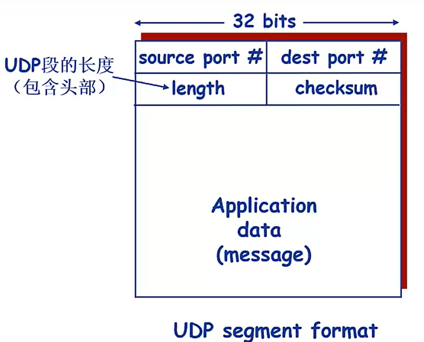

# 计算机网络原理
## 1 计算机网络概述
### 1.1 计算机网络基本概念
`计算机网络是计算机技术与通信技术相互融合的产物，计算机网络是互连的、自治的计算机的集合。`
* 自治： 互连的计算机系统彼此独立，不存在主从或者控制与被控制关系。
* 互连： 利用通信链路连接相互独立的计算机系统。通信链路可以是双绞线、光纤、微波、通信卫星等。

**协议三要素**： 语法、语义、时序
* 语法： 定义实体之间交换信息的格式与结构，或者定义实体（比如硬件设备）之间传输的电平。
* 语义： 实体间交换的信息，除了要传输的数据之外，通常还包括控制信息，针对不同的控制信息，接收端应如何响应。
* 时序： 定义实体之间交换信息的顺序以及如何匹配或适应彼此的速度。

**计算机网络的功能**：实现硬件资源共享、软件资源共享和信息资源共享。

**计算机网络的分类**：
* 按覆盖范围分类
   1. 个域网（PAN）：个人设备通过无线通信技术构成小范围网络，实现个人设备间的数据传输。范围1-10m
   2. 局域网（LAN）：通常部署在办公室、校园，采用高速有线或者无线链路连接主机，实现局部范围内高速数据传输。范围10m~1km
   3. 城域网（MAN）: 城域网是指覆盖一个城市范围的网络。范围5~50km
   4. 广域网（WAN）: 异地城域网或局域网的互连。
* 按拓扑结构分类

   `网络设备间的物理连接关系与布局`
   1. 总线型拓扑结构：采用一条广播信道作为公共传输介质，称为总线，所有结点均与总线连接，结点间的通信均通过共享的总线进行。
      * 优点：结构简单，所需电缆数量少，易于拓展。
      * 缺点：通信范围受限，故障诊断与隔离较困难，容易发生冲突。
   2. 星型拓扑结构： 采用一个中央结点与网络中的所有主机连接，主机之间的通信都通过中央结点进行，
      * 优点：易于监控管理，故障诊断与隔离容易。
      * 缺点：中央结点一旦故障，全网瘫痪，网络规模受限于中央结点的端口数量。
   3. 环形拓扑结构：利用通信链路将所有的结点连接成一个闭合的环，每个结点可以从环中接收数据，并向环中进一步转发数据。
      * 优点： 所需电缆长度短，可以使用光纤，易于避免冲突。
      * 缺点： 某结点故障容易引起全网瘫痪，新结点加入撤出麻烦，存在等待时间。
   4. 网状拓扑结构： 通过多条链路与不同结点直接连接。
      * 优点：可靠性高，一条或多条链路故障时，其他网络仍然可用。
      * 缺点：网络结构复杂，造价成本高。
   5. 树形拓扑结构： 通过级联星型拓扑网络的中央结点，构建树形网络结构。
      * 优点：易于拓展，易于故障隔离。
      * 缺点：对根节点的可靠性要求高，一旦故障，则可能导致大范围网络不可用。
   6. 混合拓扑网络：由两种以上简单拓扑网络混合连接而成的网络。
      * 优点：易于拓展，可以构建不同规模的网络。
      * 缺点：网络结构复杂，管理维护复杂。
* 按交换方式分

   `指通过彼此互连的结点间的数据转接，实现将数据从发送结点送达目的结点的过程和技术` [详见](#network-switching-technology)
* 按网络用户属性分类
   1. 公用网：由国家或企业出资建设，面向公众提供收费或免费服务的网络。
   2. 私有网：由某个组织出资建设，专门面向该组织内部业务提供网络传输服务，不向公众开放的网络。
### 1.2 计算机网络结构

网络边缘：连接到网络上的计算机、服务器、智能手机、智能家电等称为主机或端系统，这些端系统位于网络的最边缘，故称网络边缘。

接入网络：

* 电话拨号接入
* 非对称数字用户线路（ADSL）：独享，典型的下行带宽大于上行带宽。
* 混合光纤同轴电缆（HFC）接入网络：使用调制解调器连接有线电视网的入户同轴电缆，同轴电缆连接到光纤节点，在通过光纤链路连接电缆调制解调端系统，进而接入网络。

网络核心：由通信链路互连的分组交换设备构成的网络，作用是实现网络边缘主机之间，数据的中继与转发。比较典型的分组交换设备是路由器和交换机等。
### 1.3 数据交换技术

数据交换：在网络边缘的主机之间实现相互的数据传输、信息交换。

<b id="network-switching-technology">交换方式</b>：

   1. 电路交换：通过中间交换结点为两台主机之间建立一条专用的通信线路，称为电路，然后利用该电路进行通信，通信结束后再拆除电路。
      * 优点：实时性高，时延和时延抖动较小。
      * 缺点：对于突发性数据传输，信道利用率低，且传输速率单一。
   2. 报文交换：把要发送的信息附加上发送/接收主机的地址及其他控制信息，构成一个完整的报文，然后以报文为单位在交换网络的各个结点之间以**存储-转发**的方式传送，直至送达目的主机。 
      * 优点：信道利用率高。
      * 缺点：需要缓冲存储，网络的延时时间长且不固定，存在丢包现象。
   3. 分组交换：将待传输的数据分割成较小的数据块，每个数据库附加上地址、序号等控制信息构成数据分组，每个数据分组独立传输到目的地（同报文交换方式），目的地将收到的报文重新组装，还原为报文。
      * 优点：交换设备存储容量要求低，交换速度快，可靠传输效率高，更加公平。
      * 缺点：拆分组装报文造成一定的计算资源消耗，需要附加更多的控制信息，可能丢包。
### 1.4 计算机网络性能
速率：指网络单位时间内传送的数据量，有时也称为带宽。单位：Mbit/s、kbit/s、bit/s 等。

**时延**：指数据从网络中的一个结点（主机或交换设备）到达另一个结点所需要的时间。
   * 结点处理时延：每个分组到达交换结点时，验证分组报文、检索转发表以及可能修改分组的部分控制信息所消耗时间的总和。较小，一般忽略。
   * 排队时延：等待从输出链路发送到下一个交换结点（或目的主机）的等待时间，很不确定。
   * 传输时延：一个分组在输出链路发送时，从发送第一位开始，到发送最后一位为止，所用的时间。
   * 传播时延：分组中的每个比特在发送到物理介质上时，是利用物理信号的某种特征表示的。信号从发送端发送出来，经过一定距离的物理链路到达接收端所需要的时间。

时延带宽积：表示一段链路可以容纳的数据位数，也称为以位为单位的链路长度。

   `时延带宽积 = 传播时延 * 链路带宽`

吞吐量：网络实际可以达到的源主机到目的主机的数据传输速率，理想情况下约等于瓶颈链路数据。
### 1.5 计算机网络体系结构
`采用分层的方式类组织协议，每一层都有特定的功能，上一层利用下一层所提供的服务，完成本层的功能。`

**OSI参考模型**：理论体系结构，由高层到底层
* 应用层：为用户提供一个使用网络应用的接口，包括传送文件、电子邮件、P2P应用等。
* 表示层：为应用层提供一个一致的数据格式，使字符、格式等有差异的设备之间相互通信，还可以实现文本压缩/解压缩、数据加密/解密、字符编码等。
* 会话层： 逻辑上管理两台计算机建立和终止通信，核实双方身份是否有权参加会话。在建立会话以后，对进程间的对话进行控制。
* 传输层：分段/重组报文（区分发送和接收主机上的进程）、端到端（进程到进程）的可靠数据传输、流量控制和拥塞控制机制等。
* 网络层：转发与路由。
* 数据链路层：实现在相邻两结点之间的数据可靠而有效的传输。采用帧同步技术，实现有效的差错控制。
* 物理层：在传输介质上实现无结构比特流传输，规定设备之间的机械、电气、功能和规程4个特性。

**TCP/IP参考模型**：因特网体系结构，由上到下。
* 应用层：OSI参考模型的会话层和表示层的功能合并到了应用层来实现。
* 传输层：切割报文、保证端到端的可靠性，不涉及消息如何在网络中传输。传输层协议包括：
   * **TCP**：面向连接的、可靠字节流传输控制协议，需要双方经过确认，建立连接，数据分组标称链路号有序传递，对方对收到的分组予以确认陈伟可靠传送方式，不确认为不可靠传送方式，数据传送完成，拆除链路。
   * **UDP**：无连接的、不可靠数据报协议，没有建立和拆除链路的过程，要求每个分组带有全称地址，接收后需要对分组进行排序。
* 网络互连层：把数据分组发往目的网络或主机。
* 网络接口层：对应OSI参考模型中的数据链路层和物理层, 网络层IP分组在这一层被封装到底层网络的链路层数据帧中，并最终一比特流的形式在物理介质上进行传输。
### 1.6 计算机网络与因特网的发展简史

ARPAnet: 第一个分组交换计算机网络，也是当今因特网的祖先。

NCP: 网络控制协议，第一个主机到主机的协议。

## 2 网络应用
### 2.1 计算机网络应用体系结构体

客户/服务器（C/S）结构网络应用：最典型、最基本的网络应用。通信双方分为服务器应用程序和客户端程序，服务器程序需先运行， 做好接受通信的准备。客户端程序运行后，主动请求与服务器进行通信。

纯P2P结构网络应用：所有通信都是在对等的通信方之间直接进行，通信双方没有传统意义上的客户与服务器之分。任何一个对等端既可以主动发起对另一个对等端的服务请求，也可以被动地为其他对等端提供服务。

混合结构网络应用：将C/S应用与P2P应用相结合，既有中心服务器的存在，又有对等端的直接通信。
> Napster
> * 文件搜索采用C/S结构
>    * 提供者：向中央服务器登记自己的内容
>    * 利用者：向中央服务器提交查询请求
> * 文件传输使用P2P结构
>    * 文件传输在提供者和利用者间直接进行

### 2.2 网络应用通信基本原理

通信过程：运行在不同主机上的应用进程之间以C/S方式进行的通信。被动等待客户请求服务的叫服务器进程，主动发起通信请求服务的叫客户端进程。应用进程间遵循应用协议层协议交换应用层报文。

套接字（Socket）：是典型的网络应用编程的接口。应用进程之间进行通信时，真正收发报文的通道。一个应用进程可以创建多个套接字，与同一个或不同的传输层协议进行接口。对于一个传输层协议，需要为与其接口的每个套接字分配一个编号，标识该套接字，称为端口号。

进程标识符：不同主机进程间的通信，必须拥有唯一的标识。以IP地址对不同主机进行区分，以端口号对主机不同进程间进行区分。

**应用层协议**：定义了应用进程间交换的报文类型、报文构成部分具体含义以及报文交换时序等。

### 2.3 域名系统（DNS）

**域名解析**：将域名映射为IP地址的过程，称为域名解析。

**层次化域名空间**：英特网采用了层次树状结构的命名方法。域名的结构由标号序列组成，各标号之间用点隔开。如，“...三级域名.二级域名.顶级域名”
   * 国家顶级域名（nTLD）：cn表示中国，us表示美国
   * 通用顶级域名（gTLD）：最早的顶级域名com（公司或企业）、net（网络服务机构）、edu（专用的教育机构）
   * 基础结构域名：只有一个，即arpa，用于反向域名解析，因此又称为反向域名。

域名服务器：分布式层次式数据库。
   * 根域名服务器：共13台，单个字母命名，分别是a~m，每个根服务器知道所有的顶级服务器的域名和IP地址。
   * 顶级服务器：即TLD服务器，负责管理在该顶级域名服务器注册的所有二级域名。
   * 权威域名服务器：负责一个区的域名服务器，保存该区中所有主机的域名到IP地址的映射。

**解析过程**：本地域名服务器不能直接响应的解析结果，都需要从根域名服务器开始查询，然后依次是顶级域名服务器、权威域名服务器。
   * 递归查询：提供递归查询的服务器，可以替代查询主机，进行下一步的查询，并将最终解析结果发送给查询主机。如，“虽然我不知道，但我帮你问问”
   * 迭代查询：提供迭代查询的服务器，不会代替查询主机，进行下一步的查询，只是将下一步要查询的服务器告知查询主机。如，“虽然我不知道，但我推荐你找他”

### 2.4 万维网应用
`万维网（Web）的应用主要包括Web服务器、浏览器与超文本传输协议（HTTP）等。`

HTTP：Web应用的应用层协议，定义浏览器如何向服务器发送请求以及服务器如何向浏览器进行响应。

HTTP连接：HTTP基于传输层TCP传输报文。浏览器向服务器发送请求之前，首先需要建立TCP连接。HTTP在使用TCP连接策略有分非持久性连接和持久性连接。
   1. 非持久性连接：客户与服务器建立TCP连接后，通过该连接发送请求报文，接收响应报文，然后断开连接。每次获取对象，都需要建立TCP连接，每获取一个对象需要2RTT（Round Trip Time）。
   2. 持久性连接：
      * 非流水方式持久连接：也称为非管道方式持久连接，客户端在接收到前一个响应报文后，才能发出下一个对象的请求报文。与非持久性连接相比，连续请求多个对象时，只需建立一次TCP连接，每获取一个对象只需1RTT。
      * 流水方式持久连接：也称管道方式持久连接，客户端在接收到前一个响应报文之前，连续依次发送后续对象的请求报文，然后再通过该连接依次接收服务器发回的响应报文。使用流水方式持久连接是，获取一个对象的平均时间远小于1RTT，如果忽略对象传输时间，连续多个对象请求只需1RTT；

HTTP报文：
   * 组成：起始行、首部行、空白行和实体主体。其中，起始行、空白行不可缺少，首部行可以是零活多行，实体主体则根据报文类型。功能可有可无。
   * 分类：请求报文和响应报文。请求报文与响应报文区别是起始行不同。
      * 请求报文起始行：<方法>\<URL>\<协议版本>
      * 响应报文起始行：<协议版本>\<状态码>\<短语>
   * 请求方法：GET、HEAD、POST、PUT、OPTION

Cookie：指某些网站为了辨别用户身份、会话跟踪而存储在用户本地终端上的数据。

### 2.5 Internet 电子邮件
`电子邮件是最早在Internet上流行起来的网络应用之一，可实现电子化邮件的异步传输。电子邮件系统包括邮件服务器、邮件传输协议（SMTP）、邮件读取协议等。`

邮件服务器：发送和接收邮件，同时报告邮件传送情况，是电子邮件体系结构的核心。

**发送邮件**：SMTP是电子邮件中核心应用层协议。SMTP使用传输层TCP与服务器建立可靠数据传输连接，默认端口25。经历握手阶段、邮件发送阶段和关闭阶段完成邮件传送。
   * SMTP只能传送7位的ASCII码文本内容。图像、声音、视频及非英语国家文字需要转义。
   * SMTP不能包含“CRLF.CRLF”，该信息用于标识邮件内容的结束，需要转义传输。
   * SMTP是“推送”协议区别于HTTP的“拉取”协议。
   * SMTP使用TCP的连接是持久的，直到没有邮件需要发送才关闭连接。

邮件读取：邮件读取服务器的主要作用是用户身份鉴别、访问用户邮箱、根据用户请求对邮箱中的邮件进行操作等。目前，邮件读取协议包括POP3、IMAP和HTTP。其中HTTP是Web邮件系统的邮件读取协议。

### 2.6 文件传输协议 FTP
`文件传输协议（FTP）是在互联网两个主机之间实现文件互传的网络应用。`

客户与服务器建立一条TCP持久性的连接，端口号21，用于传输命令，称为控制连接。
在传输文件等数据时，客户与服务器建立一条临时TCP连接，端口号20，用于传输数据，数据传输结束便断开，称为数据连接。
FTP这种使用两条TCP连接分别传输控制命令与数据的方式，称为带外控制。另外，FTP是有状态的协议。

### 2.7 P2P应用

P2P体系结构对服务器依赖很小，甚至对于纯P2P来讲，整个应用几乎不依赖某个集中服务器，应用都是动态地在对等双方之间进行。对等方随时可能加入应用，也随时可能离开，具有很强的应用规模伸缩性。

### 2.8 Socket 编程基础

基本类型：
   * 数据报类型套接字（SOCK_DGRAM）：面向传输层UDP协议。
   * 流式套接字（SOCK_STREAM）：面向传输层TCP协议。
   * 原始套接字（SOCK_RAW）：面向网络层协议。

系统调用及其过程：
   * 基于TCP

      `服务器程序运行后，调用socket()创建主套接字ms;调用bind(ms)绑定本地端点地址;调用listen(ms)设置主套接字为监听模式;调用accept(ms)通过主套接字接收客户端连接请求，并阻塞服务器进程，直到有客户端连接请求达到，函数调用成功并返回连接套接字ss;递归调用recv(ss)通过连接套接字接收数据，直至接收完完整数据;调用send(ss)响应请求;调用close(ss)释放连接套接字;调用accept(ms)继续等待新的客户端连接请求或调用close(ms)关闭服务。`

      `客户端程序，调用socket()创建套接字cs;调用connect(cs)请求与服务器建立TCP连接;调用send(cs)与recv(cs)实现数据发送与接收;通信结束后，调用close(cs)释放套接字，从而关闭TCP连接。`
   * 基于UDP

      `服务器程序运行后，调用socket()创建套接字ums;调用bind(ums)绑定本地端点地址;调用recvfrom(ums)接收数据（单次接收完整数据报）;调用sendto(ums)发送数据;继续调用recvfrom(ums)接收数据或调用close(ums)关闭服务。`

      `客户端程序，调用socket()创建套接字ucs;调用sendto(ucs)发送数据;调用recvfrom(ums)接收数据;调用close(ucs)释放套接字。`
   
## 3 传输层
### 3.1 传输层的基本服务

核心任务：为应用进程之间提供端到端的**逻辑通信服务**。

主要功能：
   * 传输层寻址；
   * 对应用层报文进行分段和重组；
   * 对报文进行差错检测；
   * 实现进程间端到端的可靠数据传输控制；
   * 面向应用层实现复用与分解；
   * 实现端到端的流量控制；
   * 拥塞控制；

### 3.2 传输层的复用与分解

多路复用：从多个socket（进程）接收数据，为每个数据块封装**上头部标识**，生成数据报，交给网络层；

多路分用：传输层依据头部信息将收到的数据报交给正确的套接字即不同的进程。

工作流程：
   * UDP：来自不同源IP地址/端口号的IP数据报将被导向绑定在目的端口号的**同一个**socket。
   * TCP：来自不同源IP地址/端口号的IP数据报将被导向绑定在目的端口号的**不同**socket。

头部标识：
   * UPD（二元组）：目的IP地址，目的端口号
   * TCP（四元组）：目的IP地址，目的端口号，源IP地址，源端口号

### 3.3 停-等协议与滑动窗口协议

ACK(ACKnowledge Character): 接收方发应答发送方的一种传输控制字符，表示确认发来的数据已经接受无误。 

NAK(Negative Acknowledgment): 否定应答或者非应答的缩写，用于数字通信中确认数据收到但是有错误的信号或是没有收到信号。


**不可靠传输信道的不可靠性主要表现在**：
   1. 可能出现比特差错。
   2. 可能出现乱序。
   3. 可能出现数据丢失。

**实现可靠数据传输的措施**：
   1. 差错检测：利用差错码实现数据包传输过程中的比特差错检测（甚至纠正）
   2. 确认：接收方向发送方反馈接收状态。
   3. 重传：发送发重新发送接收方没有正确接收的数据。
   4. 序号：确保数据按序提交。
   5. 计时器：解决数据包丢失问题。

停-等协议工作原理：发送方发送经过差错编码和编号的报文段，等待接收方的确认；接收方如果正确接收报文段，即差错检测无误，切序号正确，则接收报文，并向发送方发送ACK，否则丢弃报文段，并向发送方发送NAK；发送方如果收到ACK，则继续发送后续报文段，否则重发刚刚发送的报文段。

滑动窗口协议工作原理：对分组连续编号，发送方按流水线方式依序发送分组；接收方接收分组，按分组序号向上有序提交，并通过向发送方报告正确接收的分组序号（也可以利用否定确认通告出现差错的分组序号）。发送方根据接收到ACK（NAK）的序号以及计时器，想接收方继续发送新的分组或者重发某些（某个）分组。

### 3.4 用户数据协议(UDP)
`用户数据报协议UDP是Internet传输层协议，提供无连接、不可靠、数据报尽力传输服务。`

**特点**：
   * 无需建立连接（减少延迟）
   * 实现简单：无需维护连接状态
   * 头部开销少
   * 没有拥塞控制：应用可以更好地控制发送时间和速率。

**数据报结构**：
> 

校验和（checksum）：检测UDP段在传输中是否发生错误（如位翻转）
   * 计算：将数据报内容按16位求和，进位加在和的后面，将得到的值按位取反，得到校验和。
   * 比对：接收方计算得到校验和与数据报校验和字段进行比对。
      * 不相等：检测出错误。
      * 相等：没有检测出错误，但可能有错误。

## 4 网络层
### 4.1 网络层服务
`网络层结余传输层和数据链路层之间，传输层提供端到端的进程间通信服务，数据链路层的功能则是实现物理链路直接相连的两个节点之间的数据帧传输服务，而网络层关注的是如何将承载传输层报文段的网络层数据报从源主机送达目的主机。`

**转发**：当通过一条输入数据链路接收到一个分组后，路由器需要决策，通过哪条数据链路将分组发送出去，并将分组从输入接口转移到输出接口。

转发表：确定本路由器如何转发分组。

**路由**：当分组从源主机流向目的主机时，必须通过某种方式决定分组经过的路由或路径。

路由算法（路由协议）：计算分组从端到端所经过的路径的算法。

**连接建立**：从源主机到目的主机所经过的一条路径，这条路径所经过的每个路由器等网络层设备都要参与网络层连接的建立。与传输层连接对比：
   * 网络层连接：两个主机之间（路径上所有路由器等网络设备参与其中）
   * 传输层连接：两个进程之间（中间网络设备透明）

### 4.2 数据报网络与虚电路网络

**无连接服务**：不事先为系列分组的传输确定传输路径，而是发送的时路由根据网络拥塞状况实时计算，不同分组可能由于转发表的更新，传输路径可能不同，接收顺序无法保证。

**连接服务**：首先为系列分组的传输缺点葱源到目的所经过的路径（建立连接），然后固定沿该路径传输系列分组。

虚电路（VC）：路径上每个路由器都需要维护连接的状态信息。
   * 从源主机到目的主机之间的一条路径；
   * 该路径上每条链路各有一个虚电路表示（VCID）；
   * 该路径上每台交换机的转发表记录虚电路表示的连接关系；

虚电路网络和数据报网络比较：
项目|虚电路网络|数据报网络
---|:--|:--
端到端连接|需要先建立连接|不需要建立连接
地址|每个分组含有一个短的虚电路号|每个分组包含源和目的端地址
分组顺序|按序发送，按序接收|顺序发送，不一定按序接收
路由选择|建立VC时，需要路由选择，之后所有的分组都沿此路由转发|对每个分组独立选择
转发结点失效的影响|所有经过失效结点的VC终结|处理崩溃时丢失分组外，无其他影响
差错控制|由通信网络负责|由端系统负责
流量控制|由通信网络负责|由端系统负责
拥塞控制|若有足够的缓冲区分配给已建立的VC，则容易控制|由端系统负责
状态信息|建立的每条虚电路都要求占用经过的每个结点的表空间|网络不存储状态信息
通信类型|传输质量要求高的通信|数据通信，非实时通信
典型网络|X.25、帧中继、ATM|因特网

### 4.3 网络互连与网络互连设备

**异构网络**：指两个不同的网络设备**通信技术和运行协议的不同**。

实现异构网络的基本策略：对外使用一个公共协议进行数据传输如IP协议，对内使用各自网络技术和协议，构建出虚拟互连网络。
   1. **协议转换**
   2. **构建虚拟互连网络**

**路由器**：
   1. 输入端口：负责从物理接口接收信号，还原数据链路层帧，提取IP数据报，以**最长前缀匹配优先原则**决定将该数据报交换到哪个输出端口。
   2. 交换结构：将输入端口的IP数据报交换到指定的输出端口。
      * 基于内存交换
      * 基于总线交换
      * 基于网络交换
   3. 输出端口：首先提供一个缓存排队功能，排队交换到该端口的待发送分组，并从队列中不断去除分组进行数据链路层数据帧的封装，通过物理线路发送出去。
   4. 路由处理器：负责执行路由器的各种指令，包括运行路由协议、路由计算以及路由表的更新维护等。

### 4.4 网络的拥塞控制

拥塞：一种持续过载的网络状态，用户对网络资源的总需求（包括链路带宽、存储空间和处理器处理能力）超过了网络固有的容量。
   * 传输线路带宽有限
   * 缓冲区容量有限
   * 网络结点处理能力有限
   * 网络某些结点发生了故障

流量感知路由：根据网络负载动态调整，将网络流量引导到不同的链路上，均衡网络负载，从而延缓或避免拥塞发生。
   1. 多路径路由
   2. 缓慢转移流量至另一路由

准入控制：一种广泛用于虚电路网络的拥塞预防技术。
   > 基本思想：基于平均流量和瞬时流量，如果新建立的虚电路会导致网络变得拥堵，那么网络拒绝建立该新的虚电路。

流量调节：
   * 抑制分组：给拥塞数据报的源主机返回一个抑制分组。
   * 背压：让抑制分组在从拥塞结点到源结点的路径上的每一跳，都发挥抑制作用。

负载脱落：路由器主动丢弃某些数据报。
   * 丢弃新分组：如GBN
   * 丢弃老分组：如实时视频流。

### 4.5 Internet网络层

IPv4数据报格式：
   1. 版本号：4位，确定以哪个IP版本来解析数据报，IPv4。
   2. 首部字段：4位，给出IP数据报的首部长度（4字节为单位，即32位对齐），最大可表示60字节，包括可变长度的选项字段。
   3. 区分服务字段(TOS)：8位，只有在网络提供区分服务时，该字段才有效。根据不同值，提供不同类型服务，但IP网络大部分情况不使用该字段。
   4. 数据报长度：16位，给出IP数据报的总字节数，包括首部和数据部分。可以表示最大65535字节的数据报，实际上不会有这么大。
   5. 标识字段：16位，用于标识IP数据报分组。
   6. 标志位：3位，第一位是保留位，第二位禁止分片（DF），第三位更多分片（MF）。
      * DF=0，表示允许分片；DF=1，表示不允许分片。
      * MF=0，表示非最后一片；MF=0，表示最后一片（或为分片）。
   7. 片偏移：13位，表示一个IP数据报分片封装与原IP数据报的相对偏移量，即封装的数据报分片从原整个数据报的哪个字节开始，需结合MF。
   8. 生存时间（TTL）：表示IP数据报在网络中可以通过的路由器数（步跳数），每经过一次转发，计数减一；为零时，会被丢弃。
   9. 上层协议字段：8位，指示该数据报是哪个上层协议的报文段，利用该字段实现的多路复用与多路分解。
   10. 首部校验和字段：16位，实现对IP数据报首部的差错检查。
   11. 源IP地址：32位，是发出IP数据报的源主机的IP地址。
   12. 目的IP地址：32位，是IP数据报需要送达的主机IP地址。
   13. 选项字段：1-40位，用来对IP数据报首部进行拓展。
   14. 数据字段：存放IP数据报所封装的传输层的报文段。

IP数据报分片：一个IP数据报从源主机的传输过程中，可能经过多个运行不同数据链路层协议的网络，不同数据链路层协议所能承载的最大数据报长度不尽相同。当数据报长度大于最大传输单元（MTU），就需要丢弃数据报或者进行数据报分片（组装在目的主机上进行）。
```
let M; // 数据报长度
let H; // 数据报头部长度
let D = M - H; // 数据长度
let MTU; // 最大传输单元
let MS = Math.floor((MTU - H) / 8) * 8; // 最大分片可封装数据数据长度
if(M < MTU && DF == 1) {
   return;
}
let n = Math.ceil(D / MS); // 分片个数
let offset = d / 8 * ( i - 1 ); // 片偏移，i为第i个分片；
```
IP编址：将主机IP地址划分为两个部分，当前主流的划分方式为网络部分长度可变。
   1. 网络部分（NetID）：用于描述主机所属网络；
   2. 主机部分（HostID）：用于标示主机在网络内的唯一地址。
   
IP地址：32位（IPv4）编号标识主机路由器的接口。
   * 二进制标记法：11000000 10101000 00000001 01100101
   * 点分十进制标记法：192.168.0.1
   * 十六进制标记法：0xC0A80165

IP地址的划分：
   1. 分类地址：采用2分法、3中长度作为前缀（8、16、24位），整个地址空间被分为5类，A、B、C、D和E类，并规定A、B、C可以分配主机或路由器使用，D类地址作为组播地址，E类保留；
   2. 特殊地址：除了D类和E类，占IP地址空间87.5%可以用于标识网络中的主机或路由，但如下地址有特殊用途：
      * 本地主机地址：0.0.0.0/32 新加入网络还未分配IP地址时，需要用该地址表示本机。
      * 有限广播地址：255.255.255.255/32 当主机需要向其所在的所有网络设备发送数据报时，需要用改地址作为数据报目的IP地址。
      * 回送地址：127.0.0.0/8 如果IP数据报的目的地址位于这块地址中，那么该数据报将不会发送到源主机之外。
      * 私有地址：这部分地址可以在内网使用，但不能在公共互联网上使用，如果以这部分地址为目的地址的IP数据报出现在公共互联网上是，不会被转发。
   3. 无类地址(CIDR)：网络前缀不在被设计为定长的8、16、24位，而变成可以是0~32的任意值，形式为a.b.c.d/x，其中x为网络前缀长度。
   4. 子网划分：IP地址具有相同网络部分（NetID）的设备接口，不跨越路由器可以彼此物理联通。
      地址类型|点分十进制|二进制标记法
      ---|:--|:--
      目的IP地址|172.32.1.112|10101100 00100000 00000001 01100000
      子网掩码|255.255.254.0 |11111111 11111111 11111110 00000000
      子网地址|     ?        |10101100 00100000 00000000 00000000
      子网极限|?             |10101100 00100000 00000001 11111111
   5. 路由聚合：合并子网，减少路由表项，提高路由表的查找效率，可以看成是子网划分的逆过程。

子网掩码：与IP分组的目的IP地址**按位与**运算，提取子网地址。

动态主机配置协议（DHCP）：接入时获取IP地址，同一个IP地址可重复分配。
   1. 服务器发现，主机广播DHCP discover 报文
      * src： 0.0.0.0,68
      * dest：255.255.255.255,67
      * yladdr：0.0.0.0
   2. 服务器提供，当某台DHCP服务器(223.1.2.5)67号端口接收到DHCP发现报文后，广播DHCP offer 报文
      * src： 223.1.2.5,67
      * dest：255.255.255.255,68
      * yladdr：223.1.2.4 ` //预分配IP地址`
   3. 主机请求IP地址，广播DHCP request
      * src： 0.0.0.0,68
      * dest：255.255.255.255,67
      * yladdr：223.1.2.4 ` //预接收IP地址`
   4. 服务器确认IP地址，广播 DHCP ACK
      * src： 223.1.2.5,67
      * dest：255.255.255.255,68
      * yladdr：223.1.2.4 ` //确认分配IP地址`

网络地址转换（NAT）：运行在私有网络边缘路由器上，同时连接内部私有网络和公共互联网，拥有公共IP地址。通过替换进出内部私有网络的IP数据报的IP地址和端口号，支持使用私有地址的内部主机与公共互联网的服务器或其他主机进行通信。
   * 解决IPv4地址分配殆尽的问题
   * 提供内部主机安全方案
   * 内部主机分配私网地址变更无需通知公共互联网，NAT服务器公共IP变更不影响内部主机。

**互联网控制报文协议（ICMP）**：在主机和路由器之间，实现差错信息报告或主动发送ICMP询问请求报文，实现网络可达性的探询。
   1. 差错报告报文
      * 目的不可达
      * 源抑制（拥塞控制）
      * 超时/超期（TTL超时）
      * 参数问题
      * 重定向
   2. 网络探询报文
      * 回声，请求/应答（ping）
      * 时间戳，请求/应答

IPv6: NAT缓解了IPv4地址耗尽的问题，但终究是一个过渡技术，IPv6才是解决问题的理想方案。
   * 区别：
      1. 数据报格式：只有固定长度的基本首部(40字节)和荷载（拓展首部属于荷载）；下一首部字段指向选项首部或上层协议首部。
      2. 数据报不需要路由器分片，无法通过MTU较小的数据链路时，数据报会被丢弃，主机重新发个小的。
      3. 路由器不需要每次计算校验和，减小了端到端的时延。
      4. IPv6地址：长度为128位，通常采用8组冒号分隔的点分十六进制形式表示。
   * 兼容：
      1. IP地址：IPv6地址低32位写成点分十进制
      2. 数据报：通过隧道技术，在经过IPv4网络时，将整个IPv6数据报封装进IPv4数据报的荷载中，到达IPv6网络时，还原IPv6数据报。

### 4.6 路由算法与路由协议

**链路状态路由算法**：是一种全局式路由选择算法，每个路由器在计算路由时，需要构建出整个网络的拓扑图。每个路由器周期性检测、收集预期直接相连链路的费用，以及与其直接相连的路由器ID等信息，构造链路状态分组，并向全网广播扩散。
   * Dijkstra算法：
      * D(v)：到本次迭代为止，源结点到目的结点v的当前路径费用。
      * P(v)：到本次迭代为止，在源结点到目的结点v的当前路径上，结点v的前序结点。
      * c(x, y)：结点x与结点y之间的直接链路费用。
      * S：结点的集合，用于存储从源结点到目的结点的最短路径以求出的结点集合。

**距离向量路由算法**：是一种以异步的、迭代的分布式路由算法。
   * Bellman-Ford 方程：网络中每个结点x，估计自己到网络中所有节点y的最短距离，记为Dx(y)，每个结点向其邻居结点发送它距离向量的拷贝；当结点收到来自邻居的一份距离向量或者是观察到相连链路费用发生变化时，对自己的距离向量进行计算更新，若有变化会将更新后的距离向量发送给它所有的邻居结点。最终使Dx(y)收敛到真实的最短距离dx(y)。
      * 无穷计数问题：解决采用毒性逆转技术，当到达目的结点的最短链路经过某邻居结点，在广播距离向量时，对该邻居结点广播自身到目的结点的费用为无穷大。

**层次化路由**：实现大规模网络路由选择最有效的、最可行的解决方案就是层次化路由选择。将大规模互联网安组织边界、管理边界、网络技术活功能边界划分为多个自治系统(AS)，每个自治系统有一组运行相同路由协议和路由选择算法的路由器组成。

**Internet路由选择协议**：
   1. 自治系统内路由选择协议：又称内部网关协议（IGP）
      * RIP: 主要用于小规模AS，如更接近用户的ISP或企业网络，基于距离向量路由算法，其特点：
         1. 在度量路径时，最少费用，采用的是跳数。
         2. 限制在网络直径不超过15调的自治系统内使用。
      * OSPF: 更多地用于较大规模的AS，如骨干网络，基于链路状态路由算法，其优点：
         1. 安全（所有OSPF报文可以被认证）
         2. 支持多条相同费用的路径（RIP只能选用一条）
         3. 可以针对不同的TOS设置不同优先链路
         4. 支持单播路由与多播路由集成
         5. 分层路由
   2. 自治系统间路由选择协议：又称外部网关协议（EGP）
      * BGP：从相邻AS获取某子网的可达性信息，向本AS内部的所有路由器传播跨AS的某子网可达性信息，基于某子网可达性和信息AS路由策略，决定到达该子网的最佳路由。其报文：
         1. OPEN 用来建立BGP对等方建立会话
         2. UPDATE 通告某一路由的可达性信息，或撤销已有路由
         3. KEEPALIVE 对OPEN报文的确认，或周期性地证实会话的有效。
         4. NOTIFICATION 报告差错，或用于关闭TCP连接


## 5 数据链路层与局域网
### 5.1 数据链路层服务
`沿着通信链路连接的相邻结点的通信信道称为链路，有点对点链路和广播链路，数据链路层传输单元称为帧。数据链路层提供的服务包括组帧、链路接入、可靠交付、差错控制。`
### 5.2 差错控制
`通过差错编码技术，实现对信息传输差错的检测，并基于某种机制进行差错纠正和处理`

随机差错（独立差错）：随机噪声（热噪声、传输介质引起的噪声）引起的差错，具有典型的随机特征

突发差错：冲击噪声（雷击、电机启停引起的噪声）引起的差错，通常是连续或成片的信息差错，差错之间具有相关性。出错的第一位到最后一位成为突发长度。

**差错控制**：
   1. 检错重发：接收端利用差错编码检错，对于出错的数据请求重发以纠正。
   2. 向前纠错（FEC）：接收端利用差错编码检错，对于出错的数据利用纠错编码以纠错；比较适用于单工链路或者对实时性要求比较高的链路。
   3. 反馈校验：接收端将接收到数据原封不动发回发送端，发送端通过对比接收端反馈的数据确认接收端是否正确无误接收数据，否则重发；原理简单，易于实现，无需差错编码，缺点是需要相同传输能力的反向信道，传输效率低，实时性差。
   4. 检错丢弃：接收端对于差错编码检查不通过的数据直接丢弃；适用于容许一定比例的差错存在，实时性比较高的系统。

**基本原理**：在待传输数据信息的基础上，附加一定的冗余信息，该冗余信息建立起数据信息的某种关联关系，将数据信息以及附加的冗余信息一同发送到接收 端，接收端可以检测冗余信息表征的数据信息的关联关系是否存在，如果存在则可能没有错误，否则就一定有错误。

**差错编码**：
   * 检错码：如果编码集的汉明距离ds=r+1，则该纠错编码可以检测r位差错。

   * 纠错码：如果编码集的汉明距离ds=2r+1,则该差错编码可以纠正r为的差错。

**典型纠错编码**：
   * 奇偶校验码：增加一位冗余，取值“0”或“1”，使得编码后的码字中“1”的个数为奇数。
   * 校验和：将数据划分为16位二进制整数序列，补码求和后取反码。
   * 汉明码：若编码集的汉明距离为r，该编码方式可检查r-1位的差错，可纠错(r-1)/2位。
   * 循环冗余码：将数据比特视为一个二进制数（D），约定一个能把D整除（摩尔除）的多项式G（r+1位）；D左移r位，除以G，余数R为编码差错编码冗余。

### 5.3 多路访问控制协议
`广播信道上连接的结点很多，信道被所有结点共享，必须使用多路访问控制（MAC）协议来协调结点的数据发送`

**信道划分MAC协议**：
   1. 频分多路复用(FDM)：在频域内将信道带宽划分为多个子信道，并利用载波调制技术，将原始信号调制到对应某个子信道的载波信号上，使得同时传输的多路信号在整个物理信道带宽允许的范围内频谱不重叠。
   2. 时分多路复用(TDM)：将通信信道的传输信号在时域内划分为多个等长的时隙，每路信号占用不同的时隙，在时域是不重叠，使多路信号合用单一信道。
   3. 波分多路复用(WDM)：实质是一种频分多路复用，只是由于光纤通信中，光载波频率很高，通常用光的波长代替频率来讨论。
   4. 码分多路复用(CDM)：通过利用更长的相互正交的码片序列，分别编码各路原始数据的每个码元，使得编码后的信号在同一信道中混合传输，接收端利用码片序列的正交特性，分离各路信号。

**随机访问MAC协议**：信道有三种状态，传输状态、竞争状态和空闲状态。
   1. 时隙ALOHA：把信道时间分成离散的时隙，每个时隙为发送一帧所需的时间，每个通信站只能在每个时隙开始时刻发送帧；如果在一个时隙内发送帧出现冲突，该时隙不发数据，结点以概率P在之后的时隙重发该帧。
   2. ALOHA：任何一个站点有数据要发送时就可以直接发送至信道，并对信道侦听一段时间（通常为电波传到最远端的站，再返回本站所需的时间）。如果在这段时间里接收到接收站发来的成功接收应答，说明发送成功。否则等待一个随机时间后重试。
   3. 载波监听多路访问协议（CSMA）：通过载波监听装置，在发送数据之前，监听信道上其他站点是否在发送数据，如冲突，则先不发，等待空闲
      * 1-坚持CSMA：持续监听信道状态，直至空闲，必定发送。
      * 非坚持CSMA：间隔随机一段时间监听信道，直至空闲
      * P-坚持CSMA：适用于时隙信道，若发现信道空隙，以一定概率发送数据，重复此过程直至数据被发出。
   4. 带冲突检测的载波监听多路访问协议(CSMA/CD)：通信站使用CSMA协议进行数据发送；期间检测到碰撞，则立即终止，并发出一个冲突强化信号。在等待随机一段时间后，重复尝试发送。

**受控接入MAC协议**：
   1. 集中式控制：利用轮询技术，系统中有一个主机负责轮询从属结点，结点只有收到轮询数据帧才能发送数据  。
   2. 分散式控制：利用令牌技术，令牌是一种特殊的帧，代表结点对使用信道的许可，在信道空闲时一直在信道上传输，如果结点要发送数据，就首先要获得令牌，在发完数据后，重新产生令牌并发送到信道上。

三种接入协议对比：
   1. 信道划分MAC协议：
      * 网络负载重时，共享信道效率高，且公平
      * 网络负载轻时，共享信道效率低
   2. 随机访问MAC协议：
      * 网络负载重时，产生冲突开销
      * 网络负载轻时，共享信道效率高，单个结点利用信道的全部带宽。
   3. 受控接入MAC协议：不冲突，并且单个结点利用全部带宽
### 5.4 局域网
`局部区域网络，其特点是覆盖面积小，网络传输速率高，传输错误率低。`

数据链路层拆分：
   1. 逻辑链路控制子层（LLC）：面向网络层，隐藏IEEE802系列协议之间的差异，现作用不大
   2. 介质访问控制子层（MAC）：访问控制相关的内容都放在该层

MAC地址：48位，以6个十六进制标识，用来标识局域网中的结点或网络接口。具有唯一性，生产设备时确定，厂商统一向IEEE购买可分配地址空间。

地址解析协议（ARP）：用于根据本网内的目的主机或默认网关的IP地址获取其MAC地址。在发送IP数据报时
   1. 检查自己ARP表是否含有目的主机（IP）的MAC地址，有则直接发送
   2. **广播**ARP查询分组，携带发送发IP地址、MAC地址，被查询主机IP地址
   3. 当接收到查询主机IP地址与自己的相匹配，则向发送方发送一个响应分组（**单播**）
   4. 发送发接收到响应分组，将映射关系存如ARP表，并设置过期时间（一般为20分钟）

冲突域：在一个局域网内，如果任意两个结点同时向物理介质中发送信号（数据），这两路信号一定会在物理介质中相互干扰或叠加，从而导致数据发送失败，那么这两个结点位于同一冲突域。

广播域：指任一结点发送链路层广播帧（目的MAC地址：FF-FF-FF-FF-FF-FF），接收该广播帧的所有结点与发送结点同属于一个广播域。

以太网：提供不可靠、无连接服务；采用CSMA/CD协议，利用曼彻斯特编码发送，使用二进制指数后退算法来确定碰撞后的重传时机。
   1. 目的地址：6字节，MAC地址
   2. 源地址：同上
   3. 类型：2字节，指示帧中封装的上层协议数据是哪种类型。
   4. 数据：46-1500字节，上层协议的数据报
   5. CRC：4字节，循环冗余校验码
   
交换机：也就是多端口的网桥，可以依据接收到的数据链路帧的目的MAC地址，选择性的**转发**到相应端口或**过滤**该帧，实现了冲突域的分割。当交换机收到帧时：
   1. 记录帧的源MAC地址，与输入链路接口
   2. 利用目的MAC地址检索交换表
   3. 如果检索到与目的MAC地址匹配的入口，且目的主机与源主机不在同一个网段，则转发到入口指向的接口，否则丢弃。
   3. 如果未检索到与目的MAC地址匹配的入口，则向除收到该帧的接口之外的所有接口转发。

虚拟局域网（VLAN）：利用路由器将一个大的广播域分割成多个广播域，即分割位多个子网。
   1. 基于交换机端口划分
   2. 基于MAC地址划分
   3. 基于上层协议类型或地址划分

点对点链路协议：一个发送端，一个接收端，一条链路；无需访问控制协议；
   * PPP：数据帧首尾分别以01111110作为帧界定符，数据中含有该序列时，采用**字节填充**（01111101），确保数据透明传输；提供三类功能
      1. 组帧：将网络层数据报封装到数据链路层帧中
      2. 链路控制协议：启动线路、检测线路、协商参数和关闭线路
      3. 网络控制协议：协商网络层选项。如，差错纠正、流量控制、按序交付
   * HDLC： 应用于点对点链路以及点对多点链路，面向位的同步传输协议。为确保数据透明传输，采用**位填充**，数据字段只要发现连续5个1，就立即插入一个0；
## 6 物理层
### 6.1 数据通信基础

消息：人类能感知的描述称为消息。

信息：对事物状态或存在方式的不确定性表达，信息是可以度量的。

通信：本质就是在一点精确或近似地再生另一点的信息。

通信系统：能够实现通信功能的各种技术。设备和方法的总体。

信号：在传输通道中的信息的载体。

数据：对客观事物的性质状态以及相互关系等进行记载的符号及其组合。

信道：以传输介质为基础的信号通道。

数据通信系统模型：


信号类型：
   * 模拟信号：信号的因变量是连续的
   * 数字信号：信号的因变量是离散的

通信方式：
   1. 单向通信：任何时间只能有一个方向的通信
   2. 双向交替通信：双方都能发送信息，但不能同时发送
   3. 双向同时通信：双方可以同时发送和接收信息
   4. 并行通信：为一个字节的每一位都设置一个传输通道，全部位同时传送
   5. 串行通信：只设置一条通道，数据的每一位依次在这条通道上传输。
   6. 异步通信：以字符为单位独立发送，一次传输一个字符
   7. 同步通信：以数据块为单位发送，一次传输多个字符

### 6.2 物理介质

导引型传输介质：
   1. 架空明线：平行且相互分离或绝缘的架空裸线线路，通常为铜线或铝线等金属导线
   2. 双绞线：两根相互绝缘的铜线并排绞合在一起，减少相邻导线的电磁干扰
   3. 同轴电缆：由同轴的两个导体构成，外导体为空心圆柱形网状编制金属导体，内导体是金属导线，两者之间填充绝缘实心介质
   4. 光纤：由两种折射率不同的导光介质符合纤维制成，内层称为纤芯，外包另一种折射率的介质，称为包层
      * 容量非常大，最高可达100Gbit/s
      * 传输损耗小，中继距离长，对远距离传输特别经济
      * 抗雷和电磁干扰性能好
      * 无串音干扰，保密性好，也不容易被窃听或截取数据
      * 体积小，重量轻

非导引型介质：
   1. 地波传播：低频信号，沿地球表面传播
   2. 天波传播：较高频信号，利用电离层的反射传播
   3. 视线传播：高频信号，点对点直线传播，中继传输

### 6.3 信道与信道容量

狭义信道：信号传输介质。

广义信道：信号传输介质和通信系统的一些变换装置。
   1. 调制信道：指信号从调制器的输出端传输到解调器的输入端经过的部分
      1. 信道总是具有输入信号端和输出信号端
      2. 信道一般是线性的，即输入信号和对应输出信号之间满足线性叠加原理
      3. 信道是因果的，即相应的输出信号应具有延时
      4. 信道使通过的信号发生畸变，即相应的输出信号会发生衰减
      5. 信道中存在噪声，即使输入信号为零，输出信号仍然具有一一定功率
   2. 编码信道：指数字信号从编码器输出端到译码器输入端经过的部分

传输特性：
   1. 恒参信道：传输特性变化小、缓慢，如微波视线传播链路和卫星链路
      1. 对信号幅值产生固定的衰减
      2. 对信号输出产生固定的时延
   2. 随参信道：传输特性随时间随机快速变化
      1. 信号的传输衰减随时间随机变化
      2. 信号的传输时延随时间随机变化
      3. 存在多径传播现象

信道容量：
   1. 连续信道容量：
      * 奈奎斯特公式：理想无噪声
         ```
            信道容量 = 2 * 信道带宽 * Math.log2(进制数)
         ```
      * 香农公式：考虑噪声
         ```
            信道容量 = 信道带宽 * Math.log2(1 + 信噪比:功率)
            信噪比:功率 = 10 ^ (信噪比:db / 10);
         ```
   2. 离散信道容量：
      1. 每个符号能够传输的最大平均信息量
      2. 时间单位内能够传输的最大平均信息量
